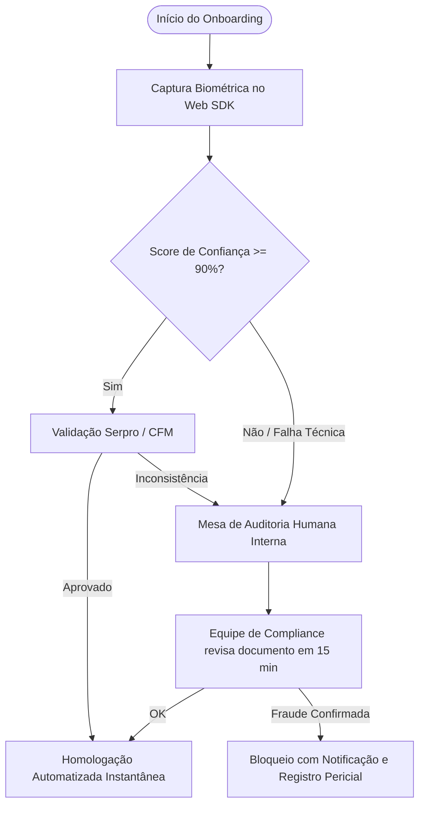

# Request for Proposal (RFP) — Verificação de Identidade com Prova de Vida & Validação de Documentos
**Projeto**: Planta y Raiz (`consultorio-medico-inteligente`)  
**Data**: 05 de Setembro de 2026  
**Finalidade**: Homologação de provedor de Biometria Facial, Liveness Detection e Background Check (Unico / Idwall / CAF)

---

## 1. Contexto e Objetivos

A plataforma Planta y Raiz opera no setor de telemedicina e terapias canabinoides de alta complexidade regulatória. Para garantir a máxima segurança dos pacientes, evitar fraudes de identidade médica e assegurar conformidade com a **Resolução CFM nº 2.314/2022**, a **Lei Geral de Proteção de Dados (Lei nº 13.709/2018, Art. 11)** e o padrão **ICP-Brasil (MP nº 2.200-2/2001 e Lei nº 14.063/2020)**, faz-se necessária a contratação de uma infraestrutura corporativa de verificação de identidade digital.

---

## 2. Escopo dos Serviços e Requisitos Técnicos

### 2.1. Prova de Vida (Liveness Detection)
- **Modalidade**: Liveness Passivo (preferencial, sem atrito para o usuário) com fallback para Liveness Ativo (desafios de movimento ou piscada).
- **Anti-Spoofing Certificado**: Certificação iBeta PAD Nível 1 e 2 (ISO/IEC 30107-3) para bloqueio de:
  - Impressões em papel de alta resolução.
  - Telas de alta definição (smartphones, tablets, monitores).
  - Máscaras 3D de silicone ou látex.
  - Deepfakes e injeções diretas de stream de vídeo virtual.
- **SDK Mobile & Web**: Compatibilidade nativa com Web (React/TypeScript), iOS (Capacitor/Swift) e Android (Capacitor/Kotlin).

### 2.2. Documentoscopia Digital (OCR & Face Match)
- **Documentos Suportados**: CNH Digital/Física, RG (novo padrão nacional e modelos estaduais) e Carteira Profissional do Médico (CRM/CFM).
- **Extração Automatizada (OCR)**: Leitura de nome completo, CPF, número do registro, data de nascimento, filiação e órgão emissor com taxa de assertividade mínima de 99,2%.
- **Biometria Cruzada (1:1 Match)**: Comparação da selfie do usuário com a foto extraída do documento oficial, retornando escore de similaridade percentual e classificação binária (Match / No Match).

### 2.3. Validação em Bases Oficiais Governamentais
- Consulta direta e em tempo real a bases públicas e conveniadas:
  - **Dataprev / Serpro / Denatran**: Validação de CNH e foto oficial da base do governo.
  - **Receita Federal**: Conferência cadastral do CPF e situação regular.
  - **Conselho Federal de Medicina (CFM)**: Validação da autenticidade da inscrição do médico e verificação de especialidades registradas (RQE).

---

## 3. Conformidade Regulatória & LGPD (Dados Biométricos)

1. **Tratamento de Dados Pessoais Sensíveis (LGPD Art. 11, II, "g")**:
   - Finalidade expressa de prevenção à fraude e segurança do titular nos processos de identificação e autenticação de sistemas eletrônicos.
   - Termo de Consentimento Biométrico prévio e destacado, com registro de aceite criptografado.
2. **Guarda e Retenção Segura**:
   - Templates biométricos armazenados com criptografia AES-256 e chaves gerenciadas por HSM (Hardware Security Module).
   - Retenção dos vetores biométricos apenas pelo tempo estritamente necessário para cumprimento de dever legal e regulatório do CFM (20 anos para prontuários).
3. **Não-Compartilhamento Comercial**:
   - Vedado o compartilhamento ou enriquecimento de dados biométricos com terceiros para fins publicitários ou creditícios alheios à saúde.

---

## 4. Matriz Comparativa de Provedores Avaliados

| Critério | Unico Check | Idwall | CAF (Combate à Fraude) |
| :--- | :--- | :--- | :--- |
| **Certificação iBeta** | Nível 1 e 2 | Nível 1 e 2 | Nível 1 e 2 |
| **Base Compartilhada** | Mais de 80M de faces únicas | Amplo ecossistema bancário | Rede antifraude internacional |
| **Integração CFM** | Parceria indireta Serpro | APIs de Background Check | Validação de CRM nativa |
| **SDK Web/Capacitor** | Excelente (Web SDK nativo) | Bom (REST API + Mobile SDK) | Excelente (Drop-in widget Web) |
| **SLA de Resposta** | < 1,5 segundos (Passivo) | < 3,0 segundos | < 2,0 segundos |
| **Modelo Comercial** | Custo por transação (R$ 0,70 - R$ 1,80) | Pacote mensal ou transação | Custo por verificação aprovada |

---

## 5. Fluxo de Fallback & Contingência

1. **Falha de Conectividade com a Provedora**:
   O sistema alterna automaticamente para captura manual de alta resolução dos documentos e encaminha para a esteira administrativa interna (`/admin/aprovacoes-medicas` e `/admin/kyc-pacientes`), preservando a continuidade operacional.
2. **Falso Positivo / Iluminação Insuficiente**:
   Permitidas até 3 tentativas sequenciais com orientações visuais dinâmicas antes do encaminhamento para análise humana.
