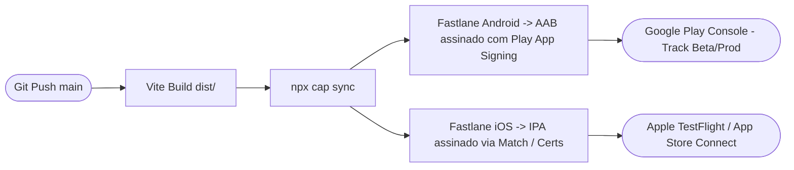

# Arquitetura de Empacotamento Nativo com Capacitor (iOS & Android)
**Projeto**: Planta y Raiz (`consultorio-medico-inteligente`)  
**Data**: 05 de Setembro de 2026  
**Identificador do Aplicativo (App ID)**: `br.com.plantayraiz.app`  
**Nome de Exibição**: `Planta y Raiz`

---

## 1. Visão Geral da Arquitetura Híbrida

O aplicativo móvel da Planta y Raiz utiliza o **Capacitor 6+** como ponte nativa sobre a base de código React 18 + Vite + TypeScript + TailwindCSS. Essa estratégia assegura:
- **Base de Código Unificada**: A mesma lógica clínica, componentes de telemedicina e validações de conformidade rodam na Web, no iOS (App Store) e no Android (Google Play).
- **Acesso Direto a Recursos de Hardware**: Câmera de alta resolução, biometria facial/digital (Face ID / Touch ID / BiometricPrompt), notificações push e geolocalização precisa.
- **Segurança Nativa do Sistema Operacional**: Sandbox estrito, proteção de memória e armazenamento criptografado no Keychain (iOS) e EncryptedSharedPreferences (Android).

---

## 2. Plugins Nativos Essenciais

| Plugin | Finalidade Clínica & Operacional |
| :--- | :--- |
| `@capacitor/camera` | Captura fotográfica de exames clínicos, laudos anteriores e receitas para a esteira de triagem e prontuário eletrônico. |
| `@capacitor/push-notifications` | Avisos em tempo real de chamadas de telemedicina, receitas assinadas liberadas e lembretes de posologia. |
| `@capacitor/geolocation` | Pareamento geográfico com farmácias autorizadas e consultórios médicos mais próximos com geocodificação reversa. |
| `@capacitor-community/biometric-auth` | Autenticação biométrica nativa para desbloqueio rápido de acesso ao prontuário médico e assinatura de documentos. |
| `@capacitor/network` | Detecção proativa de oscilação de conectividade durante consultas de vídeo com chaveamento para modo economia de banda. |
| `@capacitor/browser` | Abertura segura de fluxos de checkout e termos externos em abas no padrão Safari View Controller / Chrome Custom Tabs. |

---

## 3. Deep Linking & Roteamento de Telemedicina

O aplicativo registra os esquemas de URL universal e personalizada para retorno imediato a atendimentos:
- **Custom Scheme**: `plantayraiz://telemed/:sessionId` e `plantayraiz://prontuario/:recordId`
- **Universal Links (iOS)**: `https://plantayraiz.com.br/telemed-whatsapp` associado ao arquivo `apple-app-site-association`.
- **App Links (Android)**: Configurado com verificação de domínio via `assetlinks.json`.

Ao receber uma notificação push de consulta iniciada, o deep link abre diretamente a sala de telemedicina WebRTC criptografada sem necessidade de navegação intermediária.

---

## 4. Endurecimento de Segurança Nativa

1. **iOS App Transport Security (ATS)**:
   - Tráfego `cleartext` HTTP estritamente desabilitado.
   - Comunicação permitida apenas via TLS 1.3 com Perfect Forward Secrecy (PFS).
2. **Android Network Security Config**:
   - `android:usesCleartextTraffic="false"`.
   - Certificate Pinning para os domínios `tkxxoghzhvhjzdoomgss.supabase.co` e APIs de pagamento.
3. **Prevenção de Captura de Tela (Flag Secure)**:
   - Em telas sensíveis de prontuário e prescrição de medicamentos controlados, ativação programática de `FLAG_SECURE` (Android) e sobreposição de cortina de segurança ao minimizar o app (iOS) para proteção contra vazamento inadvertido de dados de saúde (LGPD).

---

## 5. Pipeline de CI/CD para Lojas de Aplicativos

- **Android**: Geração de Android App Bundle (`.aab`) com otimização ProGuard/R8 para ofuscação de código e redução do tamanho final do pacote (< 18 MB).
- **iOS**: Compilação via Xcode Cloud ou runner macOS no GitHub Actions, com distribuição automatizada para beta testers médicos no TestFlight.
